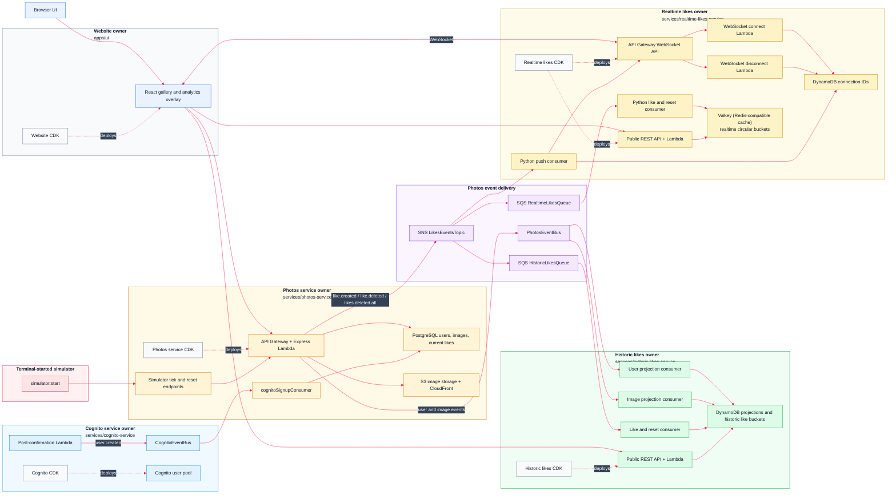

# AWS 08 - Realtime Likes Microservice

## Introduction

AWS 08 keeps the service-owned architecture from AWS 07 and adds a new `realtime-likes-service`. This is the first Python microservice in the application: the runtime handlers, event consumers, WebSocket handlers, cache client, and realtime bucket logic are Python, while CDK remains TypeScript so the service still fits the same deployment style as the other owners.

The Python realtime likes service listens to the same like stream as the historic likes service, but it has a different job. Historic likes keeps the longer-running DynamoDB record; realtime likes keeps a short, fast-moving window in Valkey (Redis-compatible cache). The Python code uses Valkey (Redis-compatible cache) as a deliberately temporary realtime read model, so the UI can show what is happening now without waiting for or querying the historic analytics tables.

The clever part is the Python circular bucket window. Likes are grouped into 5-second buckets, and those buckets are written into Valkey (Redis-compatible cache) using circular slots. As time moves forward, old slots are naturally reused, which gives the service a compact rolling view of recent image and author activity.

This release also adds real-time push notifications from the Python service to the browser using WebSockets. The UI still has REST endpoints for reading realtime charts, but it no longer has to guess when to refresh. Like events trigger a Python push consumer, the consumer sends real-time WebSocket push messages, and connected browsers refresh their realtime charts when those push notifications arrive.

## Mermaid Diagram



## Release Notes

- **A Python microservice joins the system.** `services/realtime-likes-service` is intentionally Python, not TypeScript. Its Lambda handlers are Python, its SQS like consumer is Python, its WebSocket connect/disconnect handlers are Python, its realtime push consumer is Python, and its cache utilities are Python. The service still has a TypeScript CDK app, but the application runtime is Python.
- **Python setup is part of normal service ownership.** The realtime likes package has its own `setup` script, creates its own Python virtual environment, compile-checks the Python source, and runs that Python setup before type-checking or deployment. The root deploy command now includes `realtime-likes-service:deploy`, so the Python service deploys like a first-class owner.
- **Valkey (Redis-compatible cache) is the new realtime datastore.** AWS 07 used PostgreSQL for current photo likes and DynamoDB for historic analytics. AWS 08 adds Valkey (Redis-compatible cache) for short-lived realtime analytics. Valkey (Redis-compatible cache) is used here because realtime counters are tiny, fast-changing, and naturally temporary.
- **A circular bucket algorithm makes the cache efficient.** The Python realtime service stores likes in rolling 5-second buckets. It maps each bucket id onto a circular slot, writes image and author counters into Valkey (Redis-compatible cache), and reuses old slots as the window advances. That gives the browser a compact realtime chart without keeping an ever-growing set of cache keys.
- **The like stream now fans out to another subscriber.** The photos service still publishes `like.created`, `like.deleted`, and `likes.deleted.all` to `LikesEventsTopic`. AWS 08 adds `RealtimeLikesQueue`, so the same SNS topic now feeds both the historic likes service and the new Python realtime likes service.
- **The Python SQS consumer maintains realtime counters.** `likes_consumer.py` receives the like events, increments or decrements image and author buckets, and clears Valkey (Redis-compatible cache) when it receives `likes.deleted.all`. This gives reset and simulator flows the same realtime behaviour as normal user likes.
- **Real-time WebSocket push is now part of the product.** The realtime likes service owns an API Gateway WebSocket API, Python connect and disconnect handlers, and a DynamoDB connections table. Browsers open a WebSocket connection and wait for real-time push notifications instead of polling constantly.
- **The Python push consumer sends real-time notifications.** `realtime_push_consumer.py` is triggered by the likes SNS topic, coalesces activity by bucket, and pushes WebSocket messages such as `realtime-bucket-changed` and `likes-reset` to connected browsers. The important flow is: like event -> Python push consumer -> WebSocket push -> UI refresh.
- **The UI now combines historic and realtime views.** The analytics overlay keeps the historic charts from AWS 07 and adds realtime image and author charts from the Python service. WebSocket push notifications tell the browser when to reload the realtime chart data.
- **Simulator and reset flows now exercise both worlds.** `simulator:start` still creates like traffic through the photos service, but those events now update historic DynamoDB analytics and Python realtime Valkey (Redis-compatible cache) buckets. Reset events clear both the historic read models and the realtime cache window.

## How To Run

Most day-to-day work starts in the `monorepo` folder. The root scripts are thin wrappers around service-owned scripts, so you can either run the whole stack or step into one owner when you want to inspect something more closely.

**Install and local checks**

```bash
cd monorepo
pnpm install
pnpm -C services/photos-service run dev
pnpm -C apps/ui run dev
pnpm run type-check
```

**Deploy the backend services**

```bash
pnpm run bootstrap-up
pnpm run cognito-service:deploy
pnpm run photos-service:deploy
pnpm run historic-likes-service:deploy
pnpm run realtime-likes-service:deploy
```

**Deploy the UI**

```bash
pnpm run website:deploy
pnpm run ui:url
```

**Deploy everything in the expected order**

```bash
pnpm run deploy-everything
```

**Seed, reset, and simulate activity**

```bash
pnpm run data:seed          # upload starter images and publish image events
pnpm run simulator:start    # create like/unlike traffic from terminal users
pnpm -C services/photos-service run simulator:latest
pnpm run data:reset         # clear photos data, historic projections, and Cognito test users
```

**Useful service tests**

```bash
pnpm -C services/photos-service run test:security
pnpm -C services/historic-likes-service run test:public-api
pnpm -C services/realtime-likes-service run test:public-api
```

**Tear down**

```bash
pnpm run destroy-everything
pnpm run bootstrap-down
```

## Microservices

### Cognito Service

#### Service Overview

The Cognito service owns sign-up, sign-in, hosted UI configuration, and the post-confirmation event that tells the rest of the system a user exists. It keeps authentication separate from the photo database while still letting app users appear in the gallery experience.

#### Commands

```bash
pnpm run cognito-service:deploy
pnpm -C services/cognito-service run data:reset
pnpm run cognito-service:destroy
```

#### Endpoints

Cognito is reached through its hosted UI and OAuth endpoints rather than the application REST APIs. A realistic deployed domain looks like:

```text
http://uptick-auth-a1b2c3d4.auth.eu-west-1.amazoncognito.com/login
http://uptick-auth-a1b2c3d4.auth.eu-west-1.amazoncognito.com/logout
http://uptick-auth-a1b2c3d4.auth.eu-west-1.amazoncognito.com/oauth2/token
```

#### Event Queues

**CognitoEventBus**

Subscribers: `photos-service` through `CognitoSignupQueue`.

Messages:

```text
user.created
```

#### Databases And Caches

Cognito owns the user pool. The photos service stores an app-facing user row after it receives the signup event.

#### SSM Parameters And Secrets

```text
/cognito/domain
/cognito/client-id
/cognito/user-pool-id
/cognito/events/event-bus-name
```

### Photos Service

#### Service Overview

The photos service owns the photo catalogue, image uploads, current like state, simulator endpoints, and the outbound domain events used by the analytics services. It is the main user-facing backend for the gallery.

#### Commands

```bash
pnpm run photos-service:deploy
pnpm -C services/photos-service run database:migrate
pnpm -C services/photos-service run database:reset
pnpm -C services/photos-service run data:seed
pnpm -C services/photos-service run data:reset
pnpm -C services/photos-service run simulator:start
pnpm -C services/photos-service run test:security
pnpm run photos-service:destroy
```

#### Endpoints

```text
http://photos-api-a1b2c3d4.execute-api.eu-west-1.amazonaws.com/health
http://photos-api-a1b2c3d4.execute-api.eu-west-1.amazonaws.com/gallery-photos
http://photos-api-a1b2c3d4.execute-api.eu-west-1.amazonaws.com/images/{imageId}
http://photos-api-a1b2c3d4.execute-api.eu-west-1.amazonaws.com/auth/photos/gallery
http://photos-api-a1b2c3d4.execute-api.eu-west-1.amazonaws.com/auth/photos/presigned-url
http://photos-api-a1b2c3d4.execute-api.eu-west-1.amazonaws.com/auth/photos/{imageId}/like
http://photos-api-a1b2c3d4.execute-api.eu-west-1.amazonaws.com/auth/users/me
http://photos-api-a1b2c3d4.execute-api.eu-west-1.amazonaws.com/auth/users/me/nickname
http://photos-api-a1b2c3d4.execute-api.eu-west-1.amazonaws.com/auth/admin/member
http://photos-api-a1b2c3d4.execute-api.eu-west-1.amazonaws.com/auth/admin/photos
http://photos-api-a1b2c3d4.execute-api.eu-west-1.amazonaws.com/simulation/tick
http://photos-api-a1b2c3d4.execute-api.eu-west-1.amazonaws.com/simulation/likes
```

The `/auth/...` routes expect a signed-in user. The `/simulation/...` routes are for repeatable demos and use the simulator secret rather than a browser session.

#### Event Queues

**PhotosEventBus**

Subscribers: `historic-likes-service` user projection consumer and image projection consumer.

Messages:

```text
user.created
user.updated
user.deleted
image.created
image.updated
image.deleted
```

**LikesEventsTopic**

Subscribers: `historic-likes-service` through `HistoricLikesQueue`, `realtime-likes-service` through `RealtimeLikesQueue`, and the realtime push Lambda.

Messages:

```text
like.created
like.deleted
likes.deleted.all
```

**CognitoSignupQueue**

Owner: photos service. Subscriber: `cognitoSignupConsumer` inside the photos service.

Messages:

```text
user.created
```

#### Databases And Caches

```text
registered_user
images
image_likes
```

PostgreSQL is the source of truth for app users, images, and current likes. Image files live in S3 and are served through CloudFront.

#### SSM Parameters And Secrets

```text
/services/photos-service/base-url
/photos/rds/secret-arn
/photos/images/bucket-name
/photos/images/distribution-url
/photos/events/event-bus-name
/photos/events/likes-topic-arn
/photos/cognito-signup/queue-url
/simulator/secret
```

Consumed parameters:

```text
/cognito/user-pool-id
/cognito/events/event-bus-name
```

### Historic Likes Service

#### Service Overview

The historic likes service turns photo, user, and like events into DynamoDB read models for longer-running analytics. The browser reads charts from this service instead of asking the photos database to perform reporting work.

#### Commands

```bash
pnpm run historic-likes-service:deploy
pnpm -C services/historic-likes-service run data:reset
pnpm -C services/historic-likes-service run test:public-api
pnpm run historic-likes-service:destroy
```

#### Endpoints

```text
http://historic-likes-api-e5f6g7h8.execute-api.eu-west-1.amazonaws.com/public/health
http://historic-likes-api-e5f6g7h8.execute-api.eu-west-1.amazonaws.com/public/photo-likes
http://historic-likes-api-e5f6g7h8.execute-api.eu-west-1.amazonaws.com/public/photo-likes?imageId={imageId}
http://historic-likes-api-e5f6g7h8.execute-api.eu-west-1.amazonaws.com/public/author-likes
http://historic-likes-api-e5f6g7h8.execute-api.eu-west-1.amazonaws.com/public/author-likes?authorUserId={userId}
```

#### Event Queues

**HistoricLikesQueue**

Owner: historic likes service. Publisher path: `photos-service` -> `LikesEventsTopic` -> `HistoricLikesQueue`.

Messages:

```text
like.created
like.deleted
likes.deleted.all
```

**Projection Queues**

Owner: historic likes service. Publisher path: `photos-service` -> `PhotosEventBus` -> projection consumers.

Messages:

```text
user.created
user.updated
user.deleted
image.created
image.updated
image.deleted
```

#### Databases And Caches

```text
HistoricLikesUsersTable
HistoricLikesImagesTable
HistoricPhotoBucketLikesTable
HistoricAuthorBucketLikesTable
```

The projection tables keep enough user and image context for analytics screens. The bucket tables hold accumulated like deltas by photo and by author.

#### SSM Parameters And Secrets

```text
/historic-likes/users-table-name
/historic-likes/images-table-name
/historic-likes/photo-bucket-likes-table-name
/historic-likes/author-bucket-likes-table-name
/historic-likes/queue-url
/services/historic-likes-service/base-url
```

Consumed parameters:

```text
/photos/events/event-bus-name
/photos/events/likes-topic-arn
```

### Realtime Likes Service

#### Service Overview

The realtime likes service is the new Python microservice for this release. It uses Python Lambda handlers to consume like events, write circular realtime buckets into Valkey (Redis-compatible cache), expose a Python REST API for chart data, and send real-time WebSocket push notifications to the UI. It is intentionally different from the TypeScript photos and historic likes services so the course now includes a service written in Python as well as services written in TypeScript.

#### Commands

```bash
pnpm run realtime-likes-service:deploy
pnpm -C services/realtime-likes-service run setup
pnpm -C services/realtime-likes-service run test:public-api
pnpm run realtime-likes-service:destroy
```

#### Endpoints

```text
http://realtime-likes-api-i9j0k1l2.execute-api.eu-west-1.amazonaws.com/public/health
http://realtime-likes-api-i9j0k1l2.execute-api.eu-west-1.amazonaws.com/public/realtime-likes?imageId={imageId}&authorUserId={userId}
http://realtime-likes-ws-m3n4o5p6.execute-api.eu-west-1.amazonaws.com/production
```

#### Event Queues

**RealtimeLikesQueue**

Owner: realtime likes service. Publisher path: `photos-service` -> `LikesEventsTopic` -> `RealtimeLikesQueue` -> Python SQS consumer -> Valkey (Redis-compatible cache).

Messages:

```text
like.created
like.deleted
likes.deleted.all
```

**Realtime Push Subscription**

Owner: realtime likes service. Publisher path: `photos-service` -> `LikesEventsTopic` -> Python push Lambda -> WebSocket API -> browser real-time push notification.

Messages:

```text
like.created
like.deleted
likes.deleted.all
```

#### Databases And Caches

```text
Valkey (Redis-compatible cache) realtime buckets
RealtimeWebSocketConnections DynamoDB table
```

Valkey (Redis-compatible cache) keeps circular 5-second buckets for images and authors. DynamoDB stores active WebSocket connection IDs and the push-state row that prevents the Python push consumer from flooding the browser with duplicate real-time WebSocket push messages inside the same bucket.

#### SSM Parameters And Secrets

```text
/realtime-likes/queue-url
/services/realtime-likes-service/base-url
/services/realtime-likes-service/websocket-url
```

Consumed parameters:

```text
/photos/events/likes-topic-arn
```

## UI App

### React UI

#### App Overview

The single React app provides the gallery, upload flow, authenticated profile surface, current like buttons, and analytics overlay. It talks to the photos service for catalogue actions, the historic likes service for accumulated charts, and the Python realtime likes service for short-window charts. It also opens a WebSocket connection so real-time push notifications can refresh the realtime charts as like events arrive.

#### Commands

```bash
pnpm -C apps/ui run deploy
pnpm -C apps/ui run generate-env
pnpm -C apps/ui run build
pnpm -C apps/ui run upload
pnpm -C apps/ui run invalidate-cloudfront
pnpm -C apps/ui run url
pnpm -C apps/ui run destroy
```

#### SSM Parameters Consumed

```text
/website/bucket-name
/website/distribution-id
/website/distribution-url
/cognito/domain
/cognito/client-id
/cognito/user-pool-id
/services/photos-service/base-url
/services/historic-likes-service/base-url
/services/realtime-likes-service/base-url
/services/realtime-likes-service/websocket-url
```

#### SSM Parameters Stored

```text
/website/bucket-name
/website/distribution-id
/website/distribution-url
```

## Troubleshooting

- If the UI has empty API URLs, run the relevant `generate-env` script after backend deployment.
- If sign-in works but the app cannot find the user profile, run `pnpm run data:seed` or sign up again so the Cognito signup event reaches the photos service.
- If analytics are empty after seeding, wait a few seconds for SQS/Lambda consumers, then run the public API test for the affected service.
- If a reset appears partial, run `pnpm run data:reset` from the root so photos, historic likes, and Cognito are cleared together.
- If CloudFormation says a stack already exists, destroy the owner stack from its package script and redeploy in dependency order.
- If realtime charts stay flat, check the `RealtimeLikesQueue`, the Valkey (Redis-compatible cache) connection settings, and the WebSocket URL written to SSM.

## Interesting Code Snippets New To This Release

### Python Realtime Buckets

```py
BUCKET_COUNT = 20
SECONDS_PER_BUCKET = 5
slot_number = bucket_id % BUCKET_COUNT
```

The Python service maps each 5-second bucket id onto a circular slot, writes the count into Valkey (Redis-compatible cache), and lets later buckets reuse older slots. Realtime analytics are intentionally short-lived: the historic service keeps the long-running aggregate, while Python plus Valkey (Redis-compatible cache) keeps the moving window.

### Python WebSocket Push

```py
if like_event["eventType"] == "likes.deleted.all":
    return json.dumps({"type": "likes-reset"})

return json.dumps({"type": "realtime-bucket-changed"})
```

The Python push consumer turns like events into real-time WebSocket push messages. The browser receives `realtime-bucket-changed` or `likes-reset` and then reloads the realtime chart data from the Python REST endpoint.

### Event Payloads Are Shared Contracts

```text
like.created
like.deleted
likes.deleted.all
```

The photos service publishes like events once. Historic and realtime services decide for themselves how to store and serve those events.
